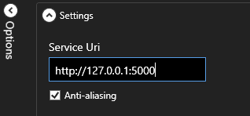
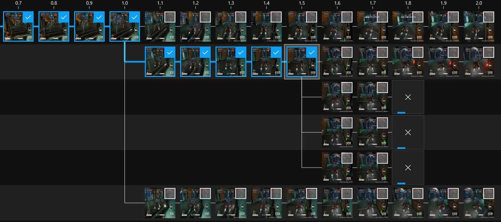
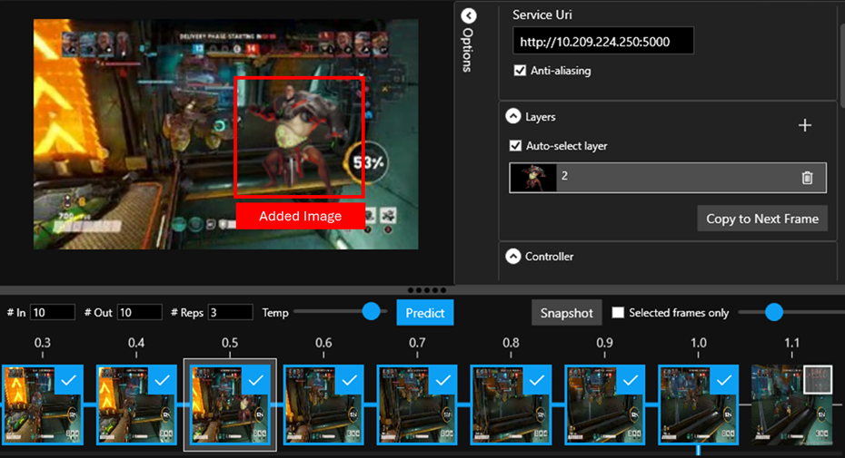
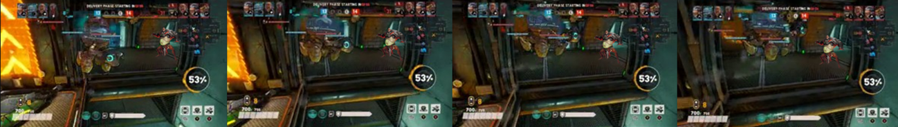
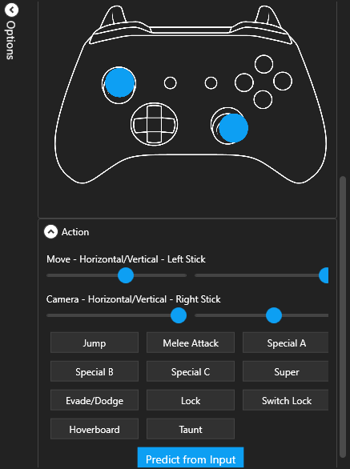

> ### AI Generated content
> Models trained using game data may potentially behave in ways that are unfair, unreliable, or offensive, in turn causing harms. We emphasize that these types of harms are not mutually exclusive. A single model can exhibit more than one type of harm, potentially relating to multiple different groups of people. For example, the output of the model can be nonsensical or might look reasonable but is inaccurate with respect to external validation sources.

# WHAM Demonstrator Instructions

## Selecting the type of endpoint
Select if you will be running the server from AI Foundry (Azure AI Endpoint) or with run_server.py (Local Server).
You might need to click on Options for the Settings to be visible.

## Entering a Server IP Address (Local Deployment)
If you have deployed your own model using run_server.py. The model and API should be hosted on a server and port that is accessible to the app. Enter the IP address with port into the text box at the top left of the window, in the form `http://127.0.0.1:5000`.

## Entering Server IP Address and API Key (Azure AI Foundry)
If you have deployed your model in Azure AI Foundry. Enter the endpoint address as well as the API Key.

## Opening Starting Frames
Creating sequences requires at least one start frame to generate gameplay sequence from. The WHAM Demonstrator contains some example starting frames. You can open the example frames using the “Open Example” button.

You can also start with either one or more images that you choose, or you can open a previously saved generated gameplay sequence timeline.

To open one or more images to seed a generated gameplay sequence, select `File -> Open Image(s)…`, and select one or more images. The images will appear as the first images on the timeline at the bottom of the window. To open a previously saved timeline, select `File -> Open Timeline JSON…` and select the JSON file saved with the timeline. The seed images should now appear in the timeline at the bottom of the view.

## Prediction Parameters
When creating generated gameplay sequence, there are a number of parameters you can set:

- **In**: The number of input frames into the next generated gameplay sequence. The maximum is 10.
- **Out**: The number of frames you would like to be returned per generated sequence.
- **Reps**: The number of branches for each generated gameplay sequence initiated.
- **Temp**: The temperature of the generated sequence. The higher this value, the more dynamic the generated gameplay sequence may be.

## The Timeline User Interface
The timeline can get quite big. Here are a few controls to help manage the user interface when the timeline is large:

- **Resize bar**: Click and drag this to change the vertical size of the timeline.
- **Frame selection**: If you want to focus in on a particular pathway, you can select the end frame, and all frames leading up to it will also be selected.
- **Selected frames only**: Toggle this to flatten the timeline to only the selected frames.
- **Zoom slider**: Use this to change the frame size. Note, smaller frames will be covered by the selection box.

There is also a “snapshot” button that allows you to take a single picture of your entire timeline, even if it has scrolled out of view. 
When you select a frame, you will see an outline around the frame in the timeline, and the frame will appear in the main area above.

**Note**: When making a frame the selected frame (and have the image appear above), you need to click on the image part of the frame thumbnail on the timeline, not the selection box.

## Generating gameplay sequence
To create a generated gameplay sequence (or set of generated gamepla sequences), you must first click on the frame you would like to generate from. The WHAM Demonstrator allows creating new gameplay branches from any frame. So please ensure the frame you wish to generate from has been selected. If the parameters are correct and the server address has been entered, you can click “Predict” in the bar above the timeline. You should see the selected number of generated gameplay sequence branches, and new frames start to appear.

The frames may take a number of seconds to appear, depending on the hardware used to host the model. You can cancel one of the branches at any moment by clicking on the ‘X’ in the last frame square. When the frame generation is complete, you can select another frame anywhere in the timeline and select “Predict” again.

## Manipulating Images
New image layers can be added to any gameplay frame to introduce new content or characters to include in future generated frames. You could add a power-up or an NPC to a frame and have those included as the gameplay sequence evolves. 

**Note**: This feature is not fully supported yet in the models shared with the WHAM Demonstrator, so performance can be unpredictable. To help added elements really “stick” in the generated sequence, we recommend creating a sequence of 5 frames with your added element in before continuing to generate sequences.

To add a new element, select the frame you wish to manipulate so it appears in the main frame area and click the `+` button in the layers panel. 

You will then be prompted to select an image. We recommend a transparent PNG, like the example supplied within the Examples folder called "Layer_Image". The selected image will then appear both as a layer in the layers panel, and on the currently selected frame.

To move and resize the added element, click on the element, either in the layers panel, or on the image directly, and you can use your mouse wheel to resize, or drag it around to move. Here, the character has been placed on the right of the frame. 

To easily create a sequence, click the “copy to next frame” button, and the layers will be added to the next frame for easier sequencing. Here are a further 4 frames showing the character movement as they enter from the right. 

Predictions can now happen from the manipulated frame.

**Note**: When saving a timeline, all frames are flattened, and so layer information will be lost.

## Controller Input
The WHAM Demonstrator can also be controlled using an Xbox controller. 

With a controller connected and a frame selected, you can hold down the buttons you wish to use on the controller for around a second and the desired input will be passed to the model for the next frame. When you hold buttons, a blue progress bar will appear below the controller, when this disappears, you must release all of the controller buttons. The WHAM Demonstrator does not yet support holding the buttons for multiple frame predictions. Also, in this mode, only one frame will be produced at a time. When you hold the buttons down on the controller, you will also notice that whenever a frame is selected, this controller image will show the action state of the controller too.

## Saving Generated Gameplay Sequence
If you have created a gameplay sequence timeline that you want to save, or even continue later, you can save either a flat, selected sequence of frames, or the entire timeline. 

Both of these options will ask for a folder and all of the required images and timeline information will be saved to that folder.